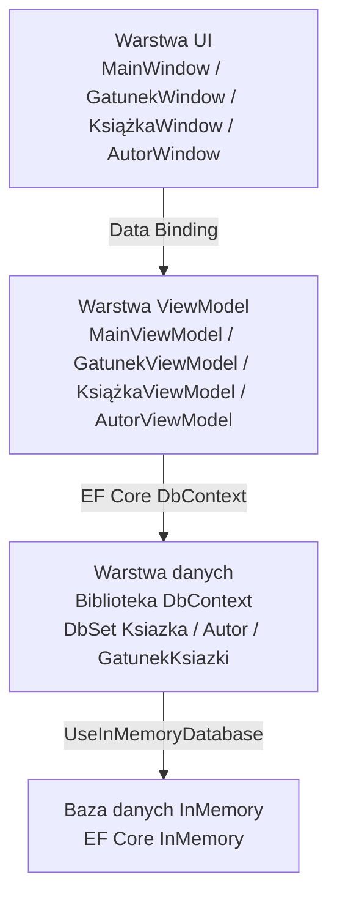

# Dokumentacja projektu – Biblioteka (PZPP)

## 1. Opis projektu

### Co aplikacja robi
Aplikacja **Biblioteka** to desktopowy system do zarządzania katalogiem bibliotecznym.
Umożliwia bibliotekarzowi przeglądanie, dodawanie, edytowanie i usuwanie książek,
autorów oraz gatunków literackich. Dane przechowywane są w bazie in-memory,
a przy każdym uruchomieniu aplikacja automatycznie generuje przykładowe dane testowe.

### Dla kogo jest
System przeznaczony jest dla pracowników biblioteki (bibliotekarzy), którzy
na co dzień zarządzają katalogiem zbiorów bibliotecznych.

---

## 2. Wymagania funkcjonalne

| ID | Wymaganie |
|----|-----------|
| WF-01 | Użytkownik może przeglądać listę wszystkich książek w katalogu |
| WF-02 | Użytkownik może dodawać nowe książki z podaniem tytułu, autora, gatunku i ilości na stanie |
| WF-03 | Użytkownik może edytować dane istniejącej książki |
| WF-04 | Użytkownik może usuwać książki z katalogu |
| WF-05 | Użytkownik może zarządzać listą autorów (dodawanie, edycja, usuwanie) |
| WF-06 | Użytkownik może zarządzać gatunkami literackimi (dodawanie, edycja, usuwanie) |
| WF-07 | Przy uruchomieniu aplikacja automatycznie wypełnia bazę przykładowymi danymi |

---

## 3. Wymagania niefunkcjonalne

| ID | Wymaganie |
|----|-----------|
| WNF-01 | **Wydajność** – aplikacja powinna uruchamiać się w czasie poniżej 3 sekund na standardowym komputerze biurowym |
| WNF-02 | **Niezawodność** – operacje zapisu i usuwania danych są natychmiastowo odzwierciedlane w widoku listy |
| WNF-03 | **Użyteczność** – interfejs jest intuicyjny i nie wymaga szkolenia; każda sekcja dostępna z poziomu głównego okna |
| WNF-04 | **Przenośność** – aplikacja działa na systemie Windows z zainstalowanym .NET 8 bez dodatkowej konfiguracji zewnętrznej bazy danych |
| WNF-05 | **Spójność danych** – relacje między encjami zdefiniowane w EF Core zapobiegają niespójnościom przy usuwaniu rekordów |
| WNF-06 | **Testowalność** – użycie bazy in-memory upraszcza testowanie logiki bez konieczności konfiguracji zewnętrznego serwera SQL |

---

## 4. Role użytkowników

| Rola | Opis | Uprawnienia |
|------|------|-------------|
| **Bibliotekarz** | Pracownik obsługujący system na stanowisku komputerowym | Pełny dostęp – przeglądanie, dodawanie, edytowanie i usuwanie książek, autorów oraz gatunków |

> Aplikacja nie posiada systemu logowania – zakłada się, że dostęp fizyczny do stanowiska
> jest wystarczającym zabezpieczeniem. Rozbudowa o uwierzytelnianie może być przedmiotem
> przyszłych wersji.

---

## 5. Przypadki użycia

### UC-01 – Dodanie nowej książki

**Aktor:** Bibliotekarz  
**Warunek wstępny:** Aplikacja jest uruchomiona; w systemie istnieje co najmniej jeden autor i jeden gatunek  
**Przebieg:**
1. Użytkownik klika przycisk „Zarządzaj Książkami" w oknie głównym
2. W oknie książek klika „Dodaj Książkę"
3. Wypełnia formularz: tytuł, wybiera autora z listy, gatunek, podaje ilość na stanie
4. Klika „Zapisz"
5. Nowa książka pojawia się na liście

**Warunek końcowy:** Książka jest zapisana w bazie i widoczna na liście

---

### UC-02 – Edycja gatunku literackiego

**Aktor:** Bibliotekarz  
**Warunek wstępny:** W systemie istnieje co najmniej jeden gatunek  
**Przebieg:**
1. Użytkownik klika „Zarządzaj Gatunkami" w oknie głównym
2. Zaznacza gatunek na liście
3. Klika „Edytuj"
4. Zmienia nazwę gatunku w oknie edycji
5. Klika „Zapisz"

**Warunek końcowy:** Zmieniona nazwa gatunku jest widoczna na liście

---

### UC-03 – Usunięcie autora

**Aktor:** Bibliotekarz  
**Warunek wstępny:** W systemie istnieje co najmniej jeden autor  
**Przebieg:**
1. Użytkownik klika „Zarządzaj Autorami" w oknie głównym
2. Zaznacza autora na liście
3. Klika „Usuń"
4. Autor zostaje usunięty z bazy

**Warunek końcowy:** Autor znika z listy

---

### UC-04 – Przeglądanie katalogu książek

**Aktor:** Bibliotekarz  
**Warunek wstępny:** Aplikacja jest uruchomiona  
**Przebieg:**
1. Użytkownik klika „Zarządzaj Książkami"
2. Na ekranie wyświetla się lista książek z tytułem, gatunkiem, ilością na stanie oraz imieniem i nazwiskiem autora

**Warunek końcowy:** Użytkownik widzi aktualny katalog zbiorów

---

## 6. Model danych

### Encje

#### `Książka`
| Pole | Typ | Opis |
|------|-----|------|
| ISBN | int (PK) | Unikalny identyfikator książki |
| Tytuł | string | Tytuł książki |
| IloscNaStanie | int | Liczba egzemplarzy dostępnych w bibliotece |
| GatunekID | int (FK) | Klucz obcy do gatunku |
| AutorID | int? (FK) | Klucz obcy do autora |

#### `Autor`
| Pole | Typ | Opis |
|------|-----|------|
| ID | int (PK) | Unikalny identyfikator autora |
| Imię | string | Imię autora |
| Nazwisko | string | Nazwisko autora |

#### `GatunekKsiążki`
| Pole | Typ | Opis |
|------|-----|------|
| ID | int (PK) | Unikalny identyfikator gatunku |
| Nazwa | string | Nazwa gatunku (np. Horror, Fantasy) |

### Relacje

- `GatunekKsiążki` **1 → N** `Książka` (jeden gatunek może mieć wiele książek)
- `Autor` **1 → N** `Książka` (jeden autor może mieć wiele książek)

---

## 7. Architektura systemu

Aplikacja zbudowana jest zgodnie z wzorcem **MVVM (Model–View–ViewModel)** w technologii WPF (.NET 8).

Kontener DI (`Microsoft.Extensions.Hosting`) zarządza cyklem życia wszystkich okien
i ViewModeli, umożliwiając wstrzykiwanie zależności (m.in. `DbContext`) do konstruktorów.

---

## 8. Technologie

| Technologia | Wersja | Uzasadnienie |
|-------------|--------|--------------|
| **C# / .NET 8** | 8.0 | Nowoczesna, wydajna platforma dla aplikacji desktopowych Windows |
| **WPF (Windows Presentation Foundation)** | .NET 8 | Dojrzały framework UI dla aplikacji Windows z pełną obsługą wzorca MVVM i data bindingu |
| **Entity Framework Core** | 9.0.14 | ORM umożliwiający pracę z bazą danych bez pisania zapytań SQL; łatwa migracja na SQL Server w przyszłości |
| **EF Core InMemory** | 9.0.14 | Baza danych w pamięci operacyjnej – idealna do prototypowania, nie wymaga instalacji serwera |
| **Microsoft.Extensions.Hosting** | 9.0.14 | Kontener dependency injection zgodny ze standardem .NET – umożliwia wstrzykiwanie DbContext i ViewModeli |
| **Bogus** | 35.6.5 | Biblioteka do generowania realistycznych danych testowych (imiona, tytuły) z obsługą języka polskiego |